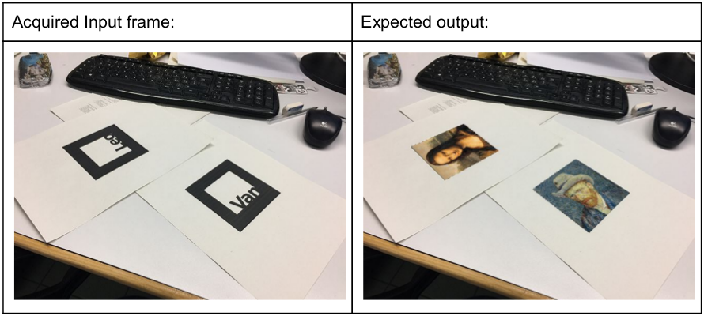

# Simple Augmented Reality System

Given a marker in a scene, the program replaces it with the corresponding painting:



## Demo


Gif displays some debug windows too.

## How to run

In order to run it you need OpenCV and CMake installed in your system, then:

```
mkdir build
cd build
cmake ../
make run
```

If you don't have OpenCV installed in the default location (which for me is `/usr/local/lib/`), you can specify the path through: `cmake ../ -DOpenCV_DIR="/path/to/opencv/build"`.

## Main steps

```
      video source
           V
           V
     ______________
    |              |
    |  +-----+     |
    |  |     |     | current frame
    |  |  Leo|     |
    |  +-----+     |
    |              |
     ¯¯¯¯¯¯¯¯¯¯¯¯¯¯

           |
           |                 -+
  Convert to grayscale        |
           |                  |
     Augment gain             | to distinguish the marker
           |                  |
         Otsu                 |
           |                 -+
           |
           |                 -+
      findContours            |
           |                  | 
      approxPolyDP            | to get 4 corners
           +                  |
    some heuristics           |
           |                 -+
           |
           |                 -+
  for each orientation of the |
  four corners detected       |
  matchTemplate               | to match the correct template
  and if it matches           | (I only match the first letter L or V)
  overlay the corresponding   |
  painting                    |
           |                 -+
           |
           V
     ______________
    |              |
    |  +-----+     |
    |  |img  |     | 
    |  |     |     |
    |  +-----+     |
    |              |
     ¯¯¯¯¯¯¯¯¯¯¯¯¯¯
```

*This is the fourth and last part of the projects that I had to develop for the Computer Vision course.*

